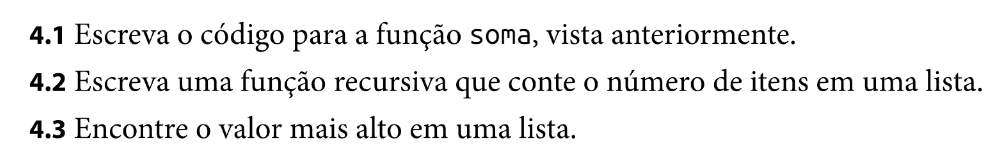

# Recursion

É uma técnica utilizada para tornar a função mais clara em termos de leitura. Substituindo o loop por uma função que chama a si mesma, podendo ser dividida em duas partes, o caso base, momento em que não há chamada da função, e o caso recursivo, onde há a chamada da função.

Seguem exercicios do livro "Entendendo algoritmos" da editora "novatec".

- Exercicios:

- Implementações:
    - [TypeScript](../src/TS/recursion.ts)
    - [Java](../src/Java/Algoritmos/src/Recursion.java)